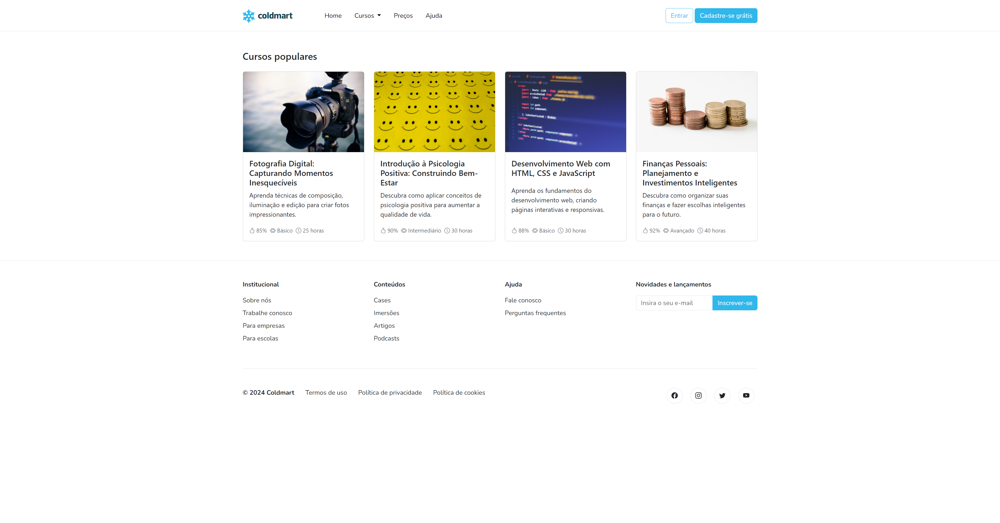

  <h1>Coldmart</h1>
  
Projeto de site para a plataforma de cursos online fictícia Coldmart, desenvolvido com HTML, CSS e Bootstrap.

  <a href="https://croldrte.github.io/Coldmart/">
    
「 Live Demo 」

  </a>

## Conteúdo
1. [Introdução](#introdução)
2. [Tecnologias utilizadas](#tecnologias-utilizadas)
3. [Estrutura](#estrutura)
4. [Captura de tela](#captura-de-tela)

## Introdução
Este repositório contém o projeto desenvolvido para uma atividade do curso técnico em Informática para Internet do [SENAI-MG](https://www.fiemg.com.br/senai/), no qual foi criado um site para a plataforma de cursos online fictícia Coldmart. O objetivo principal não foi a criação de um site completamente funcional, mas sim a implementação de um modelo estrutural básico de site, com a aplicação de conceitos e boas práticas relacionadas ao versionamento de código.

## Tecnologias utilizadas
-  **Linguagens**: HTML5 e CSS3
-  **Framework:** Bootstrap 5.3.3
-  **IDE**: Visual Studio Code
-  **Versionamento:** GIT
-  **Gestão de repositórios:** GitHub

## Estrutura
- **Menu de navegação**: Logo da marca, links úteis e botões de ação.
- **Cursos populares**: Seção de cursos em destaque com cards interativos.
- **Rodapé**: Links úteis, newsletter e redes sociais.

## Captura de tela
